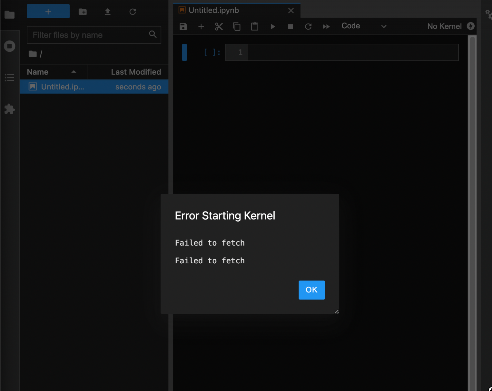

# AWS Glue Docker
This repository is a Docker reproduction of the AWS Glue environment.

## Dependency
It works under the following versions

| Tool | Version |
| --- | --- |
| Docker | 4.3.2 later |
| Docker Engine | 20.10.11 later |
| Docker Compose | v2.2.1 later |

### M1 Mac (Apple Silicon) is NOT WORK
I have not confirmed that it works on M1 Mac.
When I started Jupyter, I got `Failed to fetch` and a warning and it did not work.


## Setup

1. Run the following command
```bash
pwd # xxx/aws_glue_docker

git switch main # if Use Glue 3.0
# git switch glue-2.0 # if Use Glue 2.0

docker-compose up --build -d
```

2. Open `localhost:8888` by browser

## License
This software is released under the MIT License, see LICENSE.

# Reference
- [AWS Glueの開発環境の構築(2021) ](https://future-architect.github.io/articles/20210521a/)